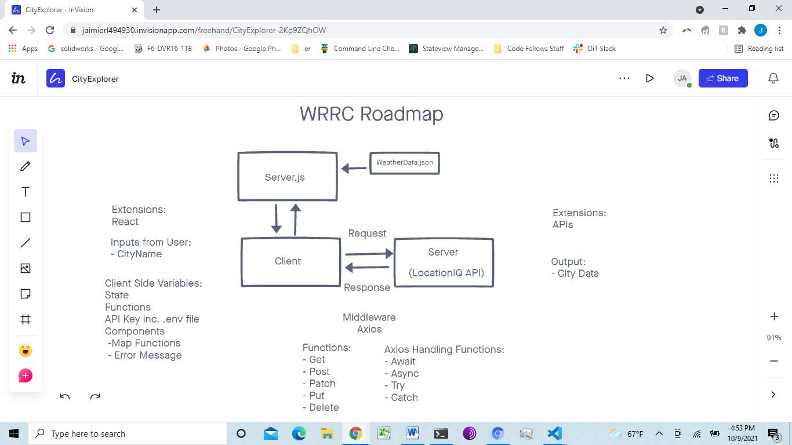

# city-explorer-api
Server for the city-explorer app

**Author**: Jae Loney
**Version**: 1.0.0 

## Roadmap
Here we can see how the programming changed as we went through the different steps in the build-out of this site. 

## Overview
Creating a local backend server for the City Explorer App

## Getting Started
Essentially to rebuild this one would need need to create a boiler plate server and populate it with information from a fake weather app

## Architecture
Created with Javascript and Netlify

## Change Log
10/9 Server Structure Set Up

## Credit and Collaborations
Thanks to all who spent time helping me debug this code!

Name of feature: Server Folder Setup
Estimate of time needed to complete: 20 minutes
Start time: 8:30pm
Finish time: 12am
Actual time needed to complete: It took 30 minutes to complete plus the three hours I spent having been accidentally  locked out of my apartment

Name of feature:Weather App from data Json
Estimate of time needed to complete: 3 hours
Start time: 9pm 10/11/21
Finish time: 8pm 10/14/21
Actual time needed to complete: 3 days

Name of feature:Weather App from Weather API
Estimate of time needed to complete: 5 hours
Start time: 9pm
Finish time: 1am
Actual time needed to complete: 4 hours

Name of feature:
Estimate of time needed to complete: 
Start time: 
Finish time: 
Actual time needed to complete: 

Name of feature:
Estimate of time needed to complete: 
Start time: 
Finish time: 
Actual time needed to complete: 

Name of feature:
Estimate of time needed to complete: 
Start time: 
Finish time: 
Actual time needed to complete: 

Name of feature:
Estimate of time needed to complete: 
Start time: 
Finish time: 
Actual time needed to complete: 

Name of feature:
Estimate of time needed to complete: 
Start time: 
Finish time: 
Actual time needed to complete: 

Name of feature:
Estimate of time needed to complete: 
Start time: 
Finish time: 
Actual time needed to complete: 

